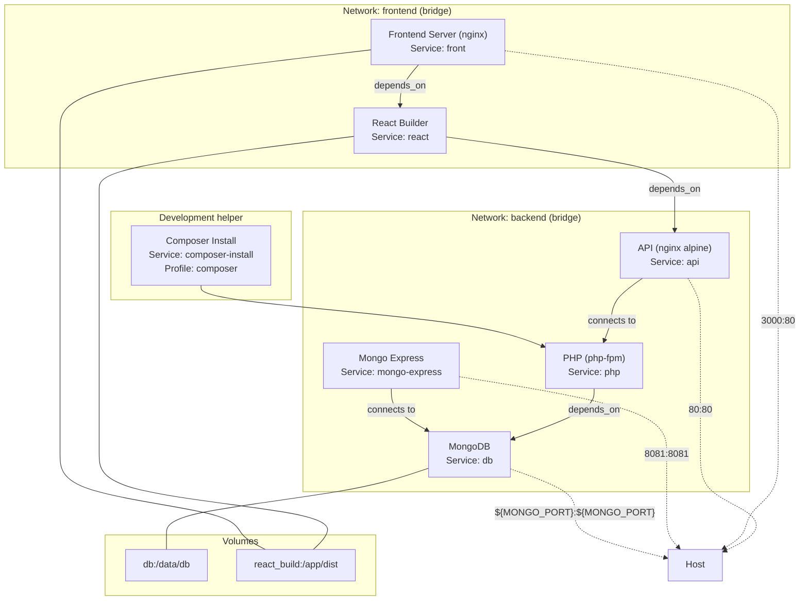

# TECHNICAL SHEET
This document describes the technical architecture, dependencies, and development principles of the project.

## Table of Contents
- [TECHNICAL SHEET](#technical-sheet)
  - [Table of Contents](#table-of-contents)
  - [Overview](#overview)
  - [Architecture](#architecture)
    - [General structure](#general-structure)
    - [Data flow](#data-flow)
    - [Docker compose](#docker-compose)
    - [Class diagram](#class-diagram)
  - [Tech Stack](#tech-stack)
  - [Backend (Symfony)](#backend-symfony)
    - [Main Bundles](#main-bundles)
    - [Structure](#structure)
    - [API Principles](#api-principles)
  - [Frontend (React)](#frontend-react)
    - [Structure](#structure-1)
    - [API Communication](#api-communication)
  - [Docker Services](#docker-services)
  - [Continuous Integration / Delivery (CI/CD)](#continuous-integration--delivery-cicd)
    - [Platform](#platform)
    - [Pipeline tasks](#pipeline-tasks)
  - [Code Quality \& Linters](#code-quality--linters)
    - [Backend](#backend)
    - [Frontend](#frontend)
  - [Testing](#testing)
    - [Backend](#backend-1)
    - [Frontend](#frontend-1)

---

## Overview
The project is a **web application** designed to help users track and visualize their daily life through forms, graphs, and relationship cards.

It is structured as a **monorepo** containing both the backend (Symfony) and frontend (React), orchestrated via **Docker Compose**.

## Architecture

### General structure
```
diary/
├── apps/                   → source code
|   ├── back/               → Symfony api
|   └── front/              → React + Vite
├── docker/
|   ├── nginx/              → Configuration for nginx servers
|   ├── php/                → Docker image for php
|   └── react/              → Docker image for react
├── .env                    → env file 
├── .env.dist               → env template
├── .gitignore
├── compose.yml             → Docker compose file
├── CONTRIBUTION.md         → How to contribute
├── makefile                → Make command (run "make help" for more)
├── README.md               → Project information
├── ROADMAP.md              → Feature list to implement
└── TECHNICAL_SHEET.md      → (this file)
```

### Data flow
1. The **frontend** communicates with the **backend API** via REST (JSON).
2. The **backend** handles:
   - Authentication and user management  
   - Data validation and persistence  
   - Export/import operations
3. The **database (MongoDB)** stores:
   - Users
   - Daily entries (mood, sleep, water, notes, etc.)
   - Contacts and relationship details
4. The **frontend** retrieves and visualizes this data via forms, timelines, and charts.

### Docker compose


### Class diagram


## Tech Stack
| Layer | Technology | Purpose |
|-------|-------------|----------|
| **Backend** | Symfony | REST API |
| **Database** | MongoDB | Document-based data storage |
| **Frontend** | React + Vite | Interactive UI |
| **Containerization** | Docker & Docker Compose | Environment orchestration |
| **Styling** | CSS (BEM methodology) | Clean, reusable, responsive UI |
| **Auth** | JWT | Secure user sessions |
| **text render** | Markdown | Text formatting |
| **Visualization** | Chart.js | Graphs and visual analytics |

## Backend (Symfony)

### Main Bundles
- `symfony/security-bundle` – authentication & authorization  
- `doctrine/mongodb-odm-bundle` – MongoDB object mapping  
- `symfony/serializer` – data serialization for API responses  
- `symfony/validator` – form and data validation  
- `lexik/jwt-authentication-bundle` – JWT authentication  

### Structure
```
src/
├── Controller/     → API endpoints
├── Entity/         → MongoDB entities (User, Contact, ...)
├── Repository/     → Data access logic
├── Service/        → Business logic
└── Security/       → JWT setup
```

### API Principles
- RESTful endpoints (`/api/...`)
- JSON request/response format
- JWT-based authentication
- Pagination and filtering for lists
- Validation errors return structured JSON

## Frontend (React)

### Structure
*not defined yet*

### API Communication
*not defined yet*

## Docker Services
| Service | Description |
|----------|-------------|
| `php` | Symfony API (PHP-FPM + Nginx) |
| `api` | Nging server used for the API |
| `db` | MongoDB database |
| `mongo-express` | MongoDB admin UI |
| `react` | Build react app |
| `front` | Nginx server used for the website |

## Continuous Integration / Delivery (CI/CD)

### Platform
**GitHub Actions** – runs automated builds, tests, and lint checks on every push and pull request

### Pipeline tasks
- Run linters and static analysis
- Execute backend and frontend tests

## Code Quality & Linters

### Backend
- **PHPStan:** static analysis for code safety and best practices
- ***PHP CS Fixer?*** 

### Frontend
- **ESLint:** detects code issues and enforces code style
- **Prettier:** automatic code formatter for JS, JSX, and CSS
- **Stylelint:** linter for CSS

## Testing
Tests are created during the developpement

### Backend
- **phpspec:** unit and behavior-driven testing for domain logic
- **Behat:** functional and acceptance tests (BDD)

### Frontend
*not defined yet*